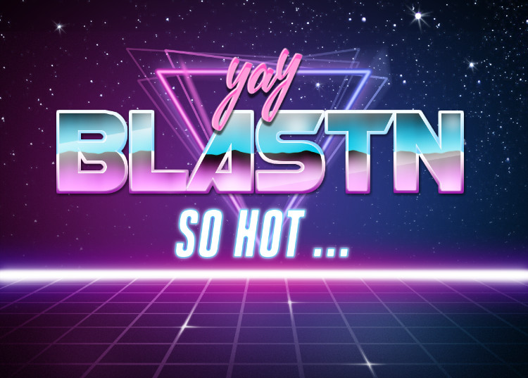
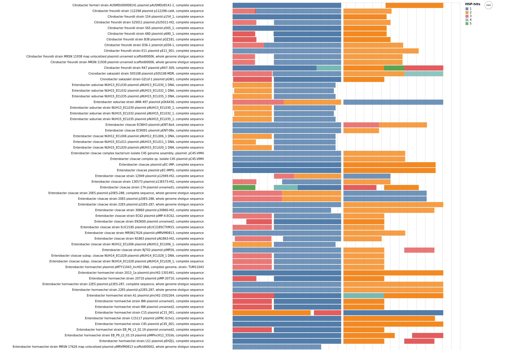

* in development use at your own risk

* this repo is a bit for the quick daily "blasts" to check up on things
  * you have a sequence(s) and reference(s) and want to check similarities?
  * either check against NCBI (might break depending on your query) or use a set of own files (recommended)
* you get a quick graphical plot in the end (see below)

```
# local
nextflow run mult1fractal/local_blastn --fasta query.fa --references references.fasta --cores 8 -profile local,docker
# NCBI query
nextflow run mult1fractal/local_blastn --fasta query.fa --cores 8 -profile local,docker
```

# example results
* blastn output gets ploted, and looks like this:
  * each "hit region" (hsp) is shown
  * chart is **not** sorted by score or best hit



# issues
samples with the exact same name will overlay on the final plot
